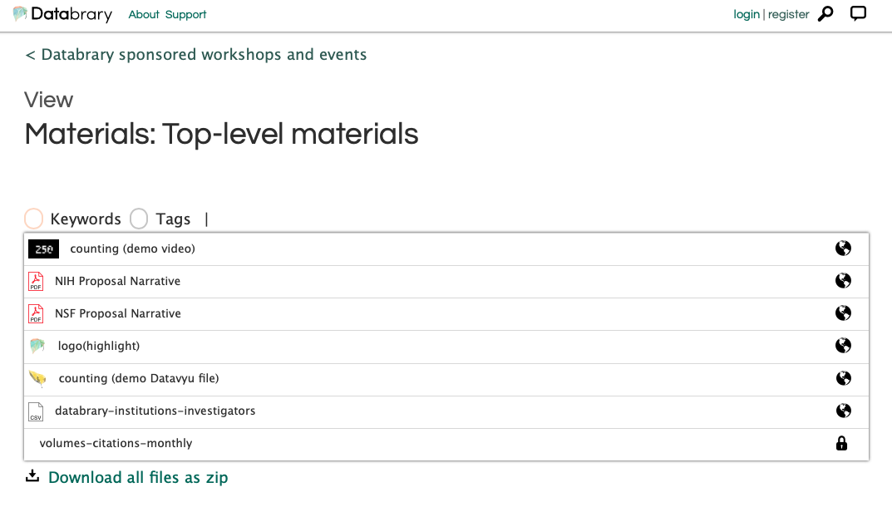

```{r, include = FALSE}
knitr::opts_chunk$set(
  collapse = TRUE,
  comment = "#>"
)
```

```{r setup}
library(datavyur)
```

## About

Datavyu (<https://datavyu.org>) is a free, open-source, desktop tool for annotating video files.

Datavyu files have an extension of `.opf`, but under-the-hood, Datavyu files are ASCII text in a zip-file wrapper.
This makes them easy to decode and manipulate outside of the application.

Datavyu is closely associated with Databrary (<https://databrary.org>), a web-based data library specialized for storing and sharing research video.
But Datavyu can and is regularly used by researchers who do not use Databrary.

## Getting started

You do not need to download and install the Datavyu desktop application to use the datavyur package.
But this vignette uses the [databraryr](https://databrary.github.io/databraryr) package to download a publicly shared Datavyu file and its accompanying video.
The databraryr package is currently available on CRAN (<https://cran.r-project.org/package=databraryr>).
It may be installed using `install.packages('databraryr')`.

Once that is done, we can download a sample Datavyu spreadsheet from <https://databrary.org/volume/1>.

```{r, eval=FALSE}
datavyur::download_opf()
```

By default, the `datavyur::download_opf()` command downloads a Datavyu file (asset 117035) from volume 1, slot 9807 (<https://nyu.databrary.org/volume/1/slot/9807>).


The file downloaded is the "counting (demo Datavyu file) with the yellow leaf icon.
It encodes information about the "counting (demo video)".
We'll show that soon.

`download_opf()` returns a character string with the full file name of the downloaded file.
This makes it easy to chain commands from datavyur using the magrittr package pipe (`%>%`) or base R (>4.1) pipe (`|>`).
The file name makes a subdirectory for the slot 9807, and uses the asset id plus the `.opf` Datavyu extension.
The file path is generated by `tempdir()`, but you can specify a different file path and name using the `file_name` parameter.

If you don't have access to the internet or don't want to use Databrary, this Datavyu file is also loaded with the datavyur package.
To find it, run the following.

```{r, eval = FALSE}
datavyur_example()
```

To get meaningful information out of the Datavyu file, we need to extract it into its three component parts.

```{r, eval=FALSE}
dv_test_fn <- datavyur::download_opf()
dv_folder <- extract_opf(dv_test_fn)
```

We see that there are three new files with names `1`, `db`, and `project`.

`1` contains information about the video file associated with the Datavyu file.
`project` contains metadata about the Datavyu coding sheet and where the original video file used to generate the coding spreadsheet came from.
`db` contains the actual time-locked codes.
